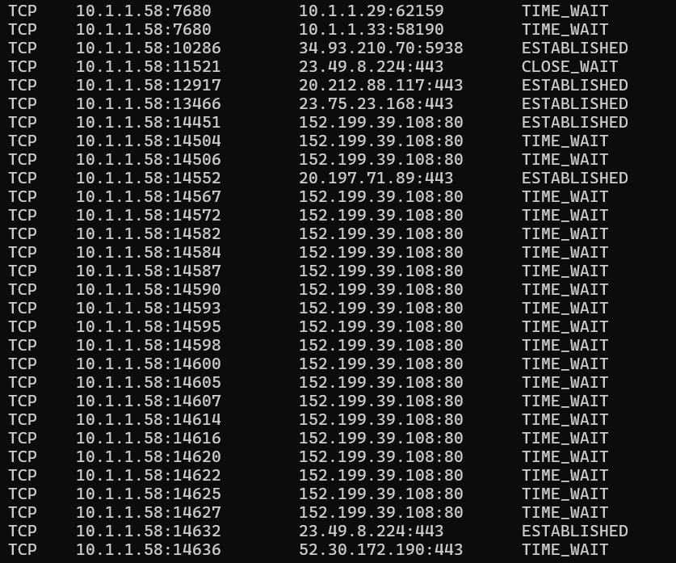
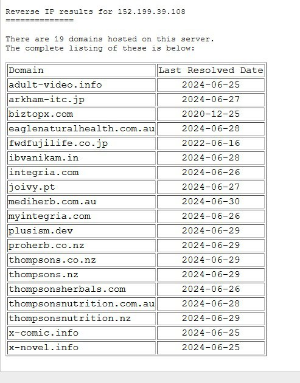
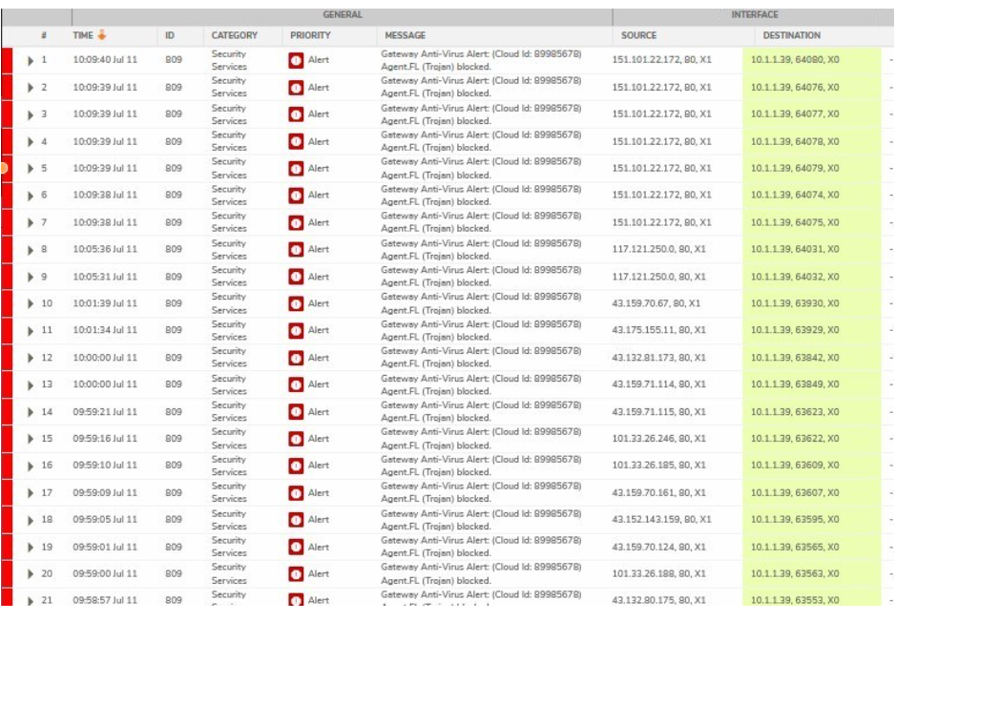
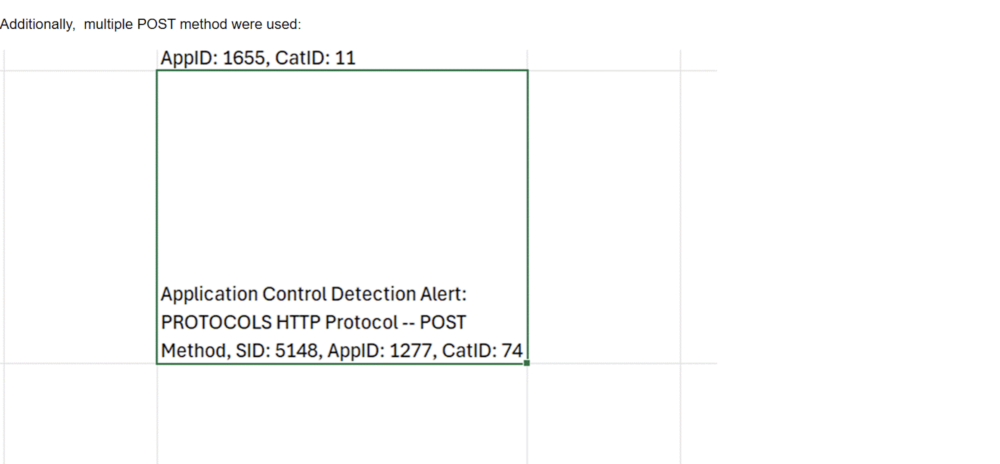

# Threat Hunting Report

## Table of Contents

1. Executive Summary  
2. Initial Observations and Endpoint Irregularities  
   - 2.1 Equipment Provisioning and Security Concerns  
   - 2.2 Local Hardening  
3. Suspicious TeamViewer Behavior and Network Traffic  
   - 3.1 Unexpected TeamViewer Execution  
   - 3.2 My Engagement - Reverse IP Analysis  
4. Internal Escalation and Network Data Collection  
   - 4.1 Escalation Timeline  
   - 4.2 Response Delays  
5. DFIR Coordination and Infrastructure Visibility  
6. Firewall Log Review and Threat Attribution  
   - 6.1 Vendor Log Access  
   - 6.2 Anomalous Device Discovery  
7. Active Threat Indicators and Compromise Extension  
   - 7.1 Targeted Endpoint Intrusions  
   - 7.2 Compromise of HR Personnel  
8. Compromise of Remote Desktop Infrastructure  
   - 8.1 Suspicious RDP Activity  
   - 8.2 Log Analysis  
9. Containment Recommendation  
10. Post-Incident Developments  
11. Key Technical Indicators of Compromise (IoCs)  

**Subject:** Investigation into Suspicious Network and Endpoint Activity  
**Location:** XYZ Company – Singapore Office  
**Period of Analysis:** 13 May 2024 – 12 August 2024  
**Prepared by:** Evans Wu  

---

## 1. Executive Summary

Between May and August 2024, a series of anomalous endpoint behaviors and network activities were observed in the Singapore office of XYZ Company.

I was engaged to conduct a preliminary investigation. The investigation was initiated following firsthand observation of unauthorized privileged access, unexpected network traffic, and anomalous user interface behavior, culminating in the involvement of a third-party DFIR team.

The findings confirm:
- Unauthorized remote access tools (TeamViewer) operating post-uninstallation 
- Persistence mechanisms indicative of lateral movement or credential harvesting  
- Endpoint compromises, impacting business operations  

---

## 2. Initial Observations and Endpoint Irregularities

### 2.1 Equipment Provisioning and Security Concerns

- An analyst started work at XYZ company was issued on 13th May 2024 and was issued the following:  
  - A Lenovo laptop previously used by a penetration tester as a development machine
  - A Dell desktop workstation  

- The Lenovo laptop exhibited severe performance degradation, taking up to 15 minutes to boot.  
- Management confirmed the laptop had not been reformatted prior to reassignment.  

### 2.2 Local Hardening

- The analyst performed manual removal of TeamViewer and RDP-related services from the Dell desktop, as company policy did not enforce a fixed application baseline.  

---

## 3. Suspicious TeamViewer Behavior and Network Traffic

### 3.1 Unexpected TeamViewer Execution

- In late June 2024, the TeamViewer login UI briefly appeared on-screen during normal operation despite the software having been previously uninstalled.  
- Event Viewer logs did not show TeamViewer service start events or installation artifacts.  
- A network scan revealed outbound connections to:  
  - Port 5938 (TeamViewer default)  
  - Multiple port 80 HTTP connections, raising suspicion  

### 3.2 My Engagement - Reverse IP Analysis

- Reverse IP lookup identified `152.199.39.108` 

---

## 4. Internal Escalation and Network Data Collection

### 4.1 Escalation Timeline

- Preliminary report issued via WhatsApp, followed by formal email notification.  
- PowerShell-based script deployed across endpoints to collect network activity logs.  
- Data consolidated for review by 1 July 2024.  

### 4.2 Response Delays

- Compliance officer was only looped in on 3 July 2024.  
- Analyst reprimanded for not escalating sooner despite clear forensic indications.  

---

## 5. DFIR Coordination and Infrastructure Visibility

- A fractional CTO was appointed to lead the incident response.  
- Restricted access and lack of documentation limited internal visibility.  
- CEO declined to submit endpoint logs, limiting scope.  

---

## 6. Firewall Log Review and Threat Attribution

### 6.1 Vendor Log Access

- Logs obtained from IT vendor covered less than 6 months due to short retention policies.  
- No SIEM, EDR, or correlation platforms; relied on manual log analysis and OSINT.  

Techniques used:  
- **Web Scraping:** monitored attacker infrastructure and public paste sites  
- **Banner Grabbing:** identified server signatures and open ports  
- **OSINT:** reverse IP lookups, WHOIS, passive DNS correlation  
- **Threat Enrichment:** checked IPs/domains against VirusTotal, AbuseIPDB  
- **TTP Mapping** cross referenced against MITRE ATT&CK framework for APT groups and common cybergangs

### 6.2 Anomalous Device Discovery

- Cross-referenced MAC addresses revealed one unidentified device absent from vendor MAC databases.  
- Multiple endpoints showed HTTP traffic to `157.240.235.61` (Facebook IP) over port 80, inconsistent with HTTPS-enforced environments.  
- Raised suspicion of:  
  - Man-in-the-middle attacks  
  - Transparent proxies  
  - Credential harvesting  

---

## 7. Active Threat Indicators and Compromise Extension

### 7.1 Targeted Endpoint Intrusions

- Live intrusion attempt observed on Compliance Officer’s MacBook.  
- Indicators included spikes in unauthorized traffic and CPU load.  

Validation steps:  
- Correlated firewall and endpoint logs  
- Banner grabbing on attacker IPs  
- Web scraping for linked credentials and malware hashes  

### 7.2 Compromise of HR Personnel

- HR team member’s Facebook account cloned and hijacked.  
- Workstation repeatedly accessed Facebook IP `157.240.235.61` over HTTP.  
- OSINT correlation confirmed persistent compromise via malware or man-in-the-middle mechanisms.  

---

## 8. Compromise of Remote Desktop Infrastructure

### 8.1 Suspicious RDP Activity

- On 12 July 2024, Head of HR observed a foreign “On-Screen Keyboard” utility on shared RDP server - first time she has observed this in the 2 years of her employment.  
- Reported only on 15 July 2024.  

### 8.2 Log Analysis

- Server logs showed:  
  - **Event ID 4648** – Explicit Credential Use  
  - **Event ID 4672** – Special Privileges Assigned  
  - User: `NT AUTHORITY\SYSTEM`  

---

## 9. Containment Recommendation

- Recommended temporary remote work arrangement to isolate internal endpoints.  
- Implementation delayed due to operational hesitations.  

---

## 10. Post-Incident Developments

- Analyst resigned on 17 July 2024 citing ethical concerns.  

---

## 11. Key Technical Indicators of Compromise (IoCs)

| Type         | Indicator         | Notes                                        |
|--------------|------------------|----------------------------------------------|
| IP Address   | 152.199.39.108   | Anomalous outbound TCP connection to external server which are associated to dodgy domains                     |
| IP Address   | 157.240.235.61   | Spoofed Facebook IP – Used in observed session hijack   |
| Network Port | 5938             | TeamViewer port was left opened despite application process being terminated            |
| Network Port | 80               | Plain HTTP – anomalous in secured infra      |
| Event ID     | 4648, 4672       | Observed multiple instances of privileged access and interactive login events/gaining foothold          |
| OS Utility   | On-Screen Keyboard | Unexpected UI artifact on RDP server        |
| MAC Address  | Unknown          | Unresolved device identity in logs           |

---

